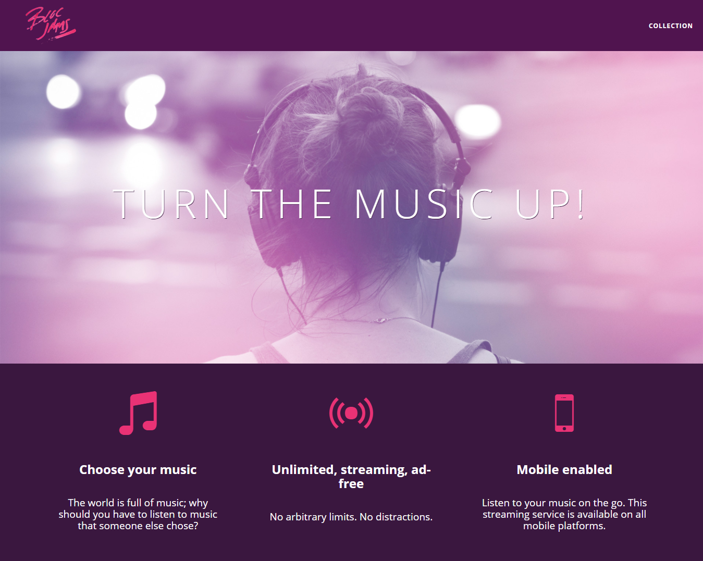

# Bloc Jams

A digital music player like Spotify that I built to learn frontend web development.

Built using pure HTML, CSS, JavaScript, and jQuery, no frontend frameworks.

See [Bloc Jams AngularJS](https://github.com/samibirnbaum/bloc-jams-angularjs) for the version I built with the frontend framework AngularJS.  

## Usage

1. Fork and clone the repo: `git clone https://github.com/samibirnbaum/bloc-jams.git`
2. Open locally in your browser of choice.